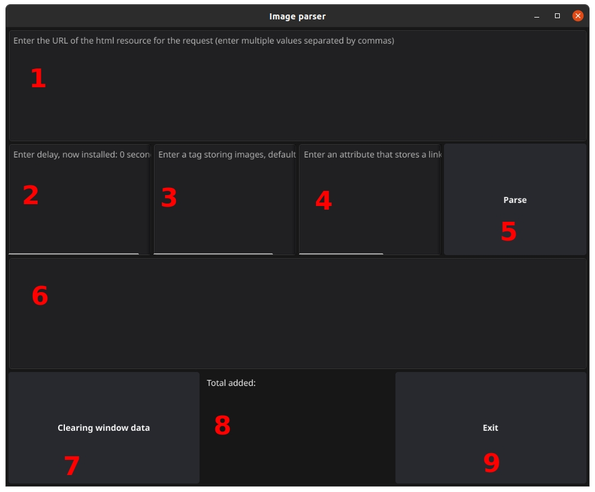

## ParseImageDesktop

A simple desktop application with a graphical interface for 
parsing image files from HTML layout.

Libraries used https://github.com/fyne-io/fyne, https://github.com/fyne-io/fyne-cross (for testing), https://github.com/golang-design/clipboard and others from the go standard library.

### Explanations:
1. Window for entering URL addresses, separated by comma. Possible entry without protocol or `www`.
2. Entering a delay for requests. May be useful on some sites.
3. Enter the tag in which to search for the image. By default `img`.
4. Enter the attribute in which to search for the image link. By default `src`.
5. Start button.
6. Output of the result:
in the process, the phrase `Wait...`, then a list of created files and the time spent is displayed.
7. The number of received files is displayed.
8. Closing the program window.

